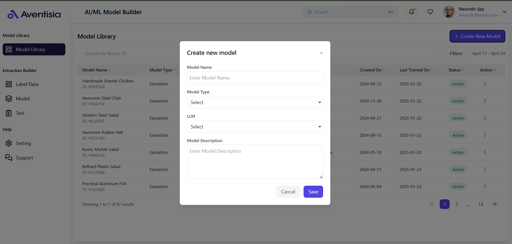

# Aventisia React Front_End Developer Assignment 

## AI Model Builder

### Key Features
- **Responsive React Table:** A dynamic table that adjusts to various screen sizes, ensuring a user-friendly experience.
- **TypeScript Typing:** Enhanced type safety and code clarity through the use of TypeScript.
- **Tailwind CSS Styling:** Modern and customizable styling using Tailwind CSS for a sleek interface.
- **Create New Model Popup:** An intuitive modal for users to input and save new model details.
- **Pagination:** Efficient navigation through data with pagination support, displaying multiple pages of models.
- **Sorting:** Users can easily sort models by name for better organization and accessibility.
- **Search Functionality:** A search bar to quickly filter models by name, improving usability and efficiency.


## Screenshot 

### Landing Screen


### Create New Model Pop-Up Window



## Project Setup

### Prerequisites
- Node.js (v16 or later)
- npm or yarn
- TypeScript

### Installation Steps
1. Create React project with TypeScript
```bash
npx create-react-app ai-model-builder --template typescript
cd ai-model-builder
```

2. Install dependencies
```bash
npm install @headlessui/react @heroicons/react tailwindcss postcss autoprefixer react-table
npm install -D @types/react-table
```

### Development Workflow
1. Implement components
2. Add mock data
3. Implement table features
4. Style with Tailwind CSS
```